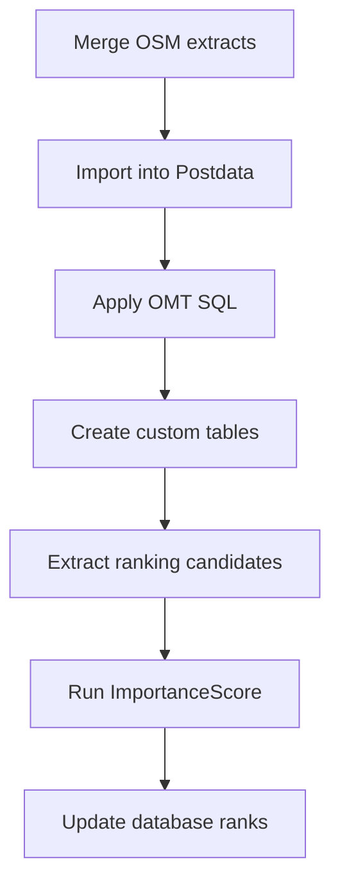
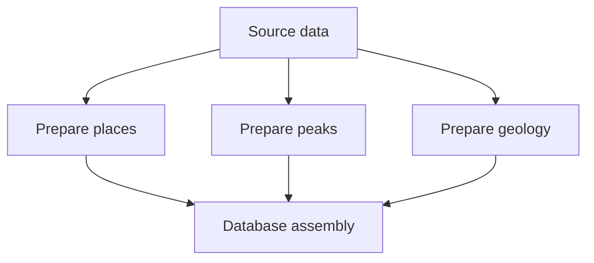

# LiteBuild Overview

A data pipeline may require hundreds of individual operations across many source files, regions, SQL scripts, database tables, and 
derived outputs. Running those steps manually is tedious and difficult to repeat reliably and  makes selective rebuilding errorprone.

LiteBuild turns those operations into a **configuration-driven dependency graph**.

Each build step describes one atomic operation and its output. Dependencies connect those steps into a workflow, while profiles provide 
dataset- or region-specific inputs and parameter overrides.

This allows the same pipeline to be used for:

* complete database rebuilds;
* periodic data refreshes;
* rebuilding only affected downstream stages;
* rerunning tools without repeating ingestion;
* processing multiple  profiles consistently;
* running independent work concurrently;
* reproducing a build later from the same configuration.

The goal is not simply to replace shell commands with YAML. The goal is to make a complex data workflow **repeatable, inspectable, incremental, 
and target-driven**.

---

## LiteBuild Configuration Model

A LiteBuild configuration has three primary sections:

```text
GENERAL
WORKFLOW
PROFILES
```

Conceptually:

```yaml
config_type: LiteBuild

GENERAL:
    ...

WORKFLOW:
    ...

PROFILES:
    ...
```

### `GENERAL`

`GENERAL` contains project-wide settings shared by the workflow.

Typical responsibilities include:

* project name;
* input directory;
* default parameters;
* common paths or values used by many steps.

Project-wide defaults belong here rather than being repeated throughout the workflow.

### `WORKFLOW`

`WORKFLOW` defines the processing graph.

Each workflow step represents an **atomic action with one primary output**.

Examples in a data data pipeline might include:

```text
download/extract source
        ↓
merge PBF files
        ↓
import into Postdata
        ↓
apply SQL schema
```

Steps declare dependencies using `REQUIRES`.

This is important because LiteBuild understands relationships between outputs rather than simply executing a long list of commands.

For example:

```text
merge_osm
    ↓
import_osm
    ↓
apply_omt_schema
    ↓
rank_places
```

If only the ranking configuration changes, the OSM merge and database ingestion stages do not need to run again.

### `PROFILES`

Profiles provide dataset-specific configuration.

A profile can represent things such as:

* a geographic region;
* an OSM extract;
* a database build variant;
* a particular source-data configuration.

Values defined by a profile can override general defaults without requiring a separate workflow definition for every dataset.

LiteBuild applies configuration values with this precedence:

```text
step
  overrides
profile
  overrides
general defaults
```

That makes it possible to define the common workflow once while changing only the inputs or settings that differ between datasets.
Only one profile can be used at a time.

---

## Why Steps Should Be Atomic

A LiteBuild step should perform one clear operation and must produce a single primary output.

That keeps dependencies understandable.

Instead of one large step such as:

```text
prepare_database
```

that internally:

```text
merges PBFs
imports OSM
runs SQL
creates tables
extracts nodes
calculates ranking
updates ranks
```

the workflow should expose those operations separately.

For example:



This provides several benefits:

* failures identify the actual operation that failed;
* outputs can be inspected independently;
* unchanged upstream work can be reused;
* downstream stages can be rerun selectively;
* dependencies are visible;
* individual commands remain understandable.

For a workflow containing hundreds of operations, this decomposition is what makes the system manageable.

---

## Logical Inputs and Outputs

Steps must reference outputs from upstream steps rather than manually reconstructing upstream filenames .

LiteBuild command templates support values such as:

```text
{INPUTS[0]}
{OUTPUT}
{PARAMETERS}
```

This lets the workflow express relationships such as:

```text
merge_osm produces merged PBF
             ↓
import_osm consumes merged PBF
```

rather than both steps independently hard-coding:

```text
build/foo/bar/build.osm.pbf
```

The dependency graph then becomes the authoritative description of how artifacts move through the pipeline.

This is particularly valuable when the same workflow is applied to multiple profiles or when
a step needs to be inserted or deleted.
---

## Parameters and Overrides

Parameters should be defined at the broadest level where they remain valid.

Use:

```text
GENERAL
```

for project defaults,

```text
PROFILE
```

for dataset-specific changes,

and:

```text
STEP
```

for values that apply only to one operation.

The precedence is:

```text
Step > Profile > General
```

This avoids duplicating nearly identical workflows.

For example, multiple regions might share:

```text
database
schema
OSM mapping
ranking algorithms
SQL scripts
```

while differing only in:

```text
source PBFs
bounding boxes
region names
certain ranking thresholds
```

Those differences belong in profiles rather than copied workflow definitions.

---

## Profiles and Profile Groups

Individual profiles can be built directly.

Conceptually:

```bash
litebuild-cli BUILD_map_data.yml --profile USWest
```

Profiles can also be organized into **groups**.

A group is an ordered collection of profiles that LiteBuild runs sequentially.

This is useful when a project consists of several related datasets or geographic regions that should be processed together.

Available profiles and groups can be inspected with:

```bash
litebuild-cli BUILD_map_data.yml --list-targets
```

The command returns the available profile and group targets.

---

## Incremental Builds

One of the primary reasons for using LiteBuild is to avoid treating every change as a full rebuild.

LiteBuild evaluates the workflow dependency graph and rebuilds invalidated branches.

For example:

```text
OSM PBF
   ↓
merge
   ↓
Postdata import
   ↓
OMT schema
   ↓
feature extraction
   ↓
ImportanceScore
   ↓
rank update
```

If the OSM source changes, much of the graph may need to run again.

If only an ImportanceScore configuration changes:

```text
OSM PBF              unchanged
merge                unchanged
Postdata import        unchanged
OMT schema            unchanged
feature extraction    maybe reusable
ImportanceScore       rebuild
rank update           rebuild
```

The workflow therefore supports both:

```text
complete reproducible rebuilds
```

and:

```text
fast incremental iteration
```

Those are complementary goals rather than competing ones.

---

## Target-Oriented Builds

Litebuild configurations always need to include the target step.  This can be
any step withing the pipeline.  LiteBuild will build only up to the selected target stage.

That is useful during development because  pipelines often contain expensive downstream operations.

For example:

```text
source preparation
      ↓
database import
      ↓
schema construction
      ↓
ranking
      ↓
static export
```

While developing ranking logic, there is no reason to repeatedly produce a static PMTiles archive.

A target build can stop once the live database has been updated.

Later, promotion can target the static-export stage.

This lets one workflow describe the entire lifecycle without requiring every invocation to perform every operation.

---

## Parallel Execution

Independent steps will be executed concurrently.

For example, if several preparation stages do not depend on one another:



LiteBuild will execute those independent branches concurrently and synchronize them when a dependent stage is reached.


---